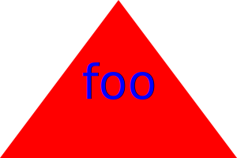

# SVG Logo Maker

## Description

The SVG Logo Maker is a Node.js command-line application that allows users to generate logos and save them as SVG files. The program prompts users to provide text, select colors, and choose shapes for the logo. The generated SVG file can be used for various purposes, such as branding and design.

## Features

- Interactive command-line interface for generating logos.
- Supports customization of text, colors, and shapes.
- Generates SVG files that can be opened in SVG-compatible applications.

### Preview

[Watch the Video](https://drive.google.com/file/d/1l42eoNtx3cEDGTNd-zJCF9ALvwyz3cM3/view)

## Installation

To use the SVG Logo Maker, follow these steps:

1. Clone this repository to your local machine.
2. Navigate to the project directory using the terminal.
3. Install the required dependencies by running the command: `npm install`

## Dependencies

The following npm packages are used to build this project:

- [svg.js](https://www.npmjs.com/package/svg.js): For creating SVG graphics.
- [inquirer](https://www.npmjs.com/package/inquirer): For interactive command-line prompts.

You can install them using the command: `npm install svg.js inquirer`

## Usage

1. Open your terminal.
2. Navigate to the project directory.
3. Run the application using the command: `npm start`
4. Follow the prompts to customize the logo with text, colors, and shapes.
5. The generated SVG file will be saved as `logo.svg` in the same directory.

## Examples

Add an example of a generated SVG logo here.

## License

This project is licensed under the terms of the [MIT License](https://opensource.org/licenses/MIT).

## Contributions

Contributions are welcome! If you find any issues or would like to suggest enhancements, please open an issue or submit a pull request.

## Questions

If you have any questions or need assistance, feel free to reach out:
- GitHub: [IsaacOnGH](https://github.com/IsaacOnGH)
- Email: isaac.melanson@yahoo.com